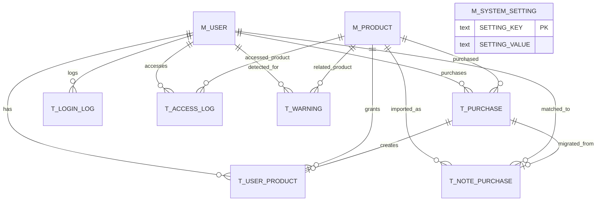

# Entity Relationship

Status: Approved

## 1. ER概要

## 2. 関係

### M_USER と T_USER_PRODUCT

1ユーザーは複数の商品権限を持てる。

1商品を3つ購入した場合ではなく、3商品を購入した場合に3レコードとなる。

### M_PRODUCT と T_USER_PRODUCT

1商品は複数ユーザーへ付与できる。

商品追加でM_USERのカラムを変更しない。

### T_PURCHASE と T_USER_PRODUCT

購入由来の権限はPURCHASE_IDで紐付ける。

テスター、管理者付与、補償はPURCHASE_IDをNULLとする。

### T_NOTE_PURCHASE と T_PURCHASE

note購入者が移行した時、正式な購入履歴をT_PURCHASEへ登録する。

作成されたPURCHASE_IDをT_NOTE_PURCHASEとT_USER_PRODUCTへ設定する。

### T_ACCESS_LOG と T_WARNING

T_ACCESS_LOGは利用事実の正本。

T_WARNINGは検知された要注意事象と対応状態を持つ。

## 3. 主キー方針

| テーブル | 主キー |
|---|---|
| M_USER | AUTH_USER_ID |
| M_PRODUCT | PRODUCT_ID |
| M_SYSTEM_SETTING | SETTING_KEY |
| T_PURCHASE | PURCHASE_ID |
| T_USER_PRODUCT | AUTH_USER_ID + PRODUCT_ID |
| T_NOTE_PURCHASE | NOTE_PURCHASE_ID |
| T_LOGIN_LOG | LOGIN_LOG_ID |
| T_ACCESS_LOG | ACCESS_LOG_ID |
| T_WARNING | WARNING_ID |
